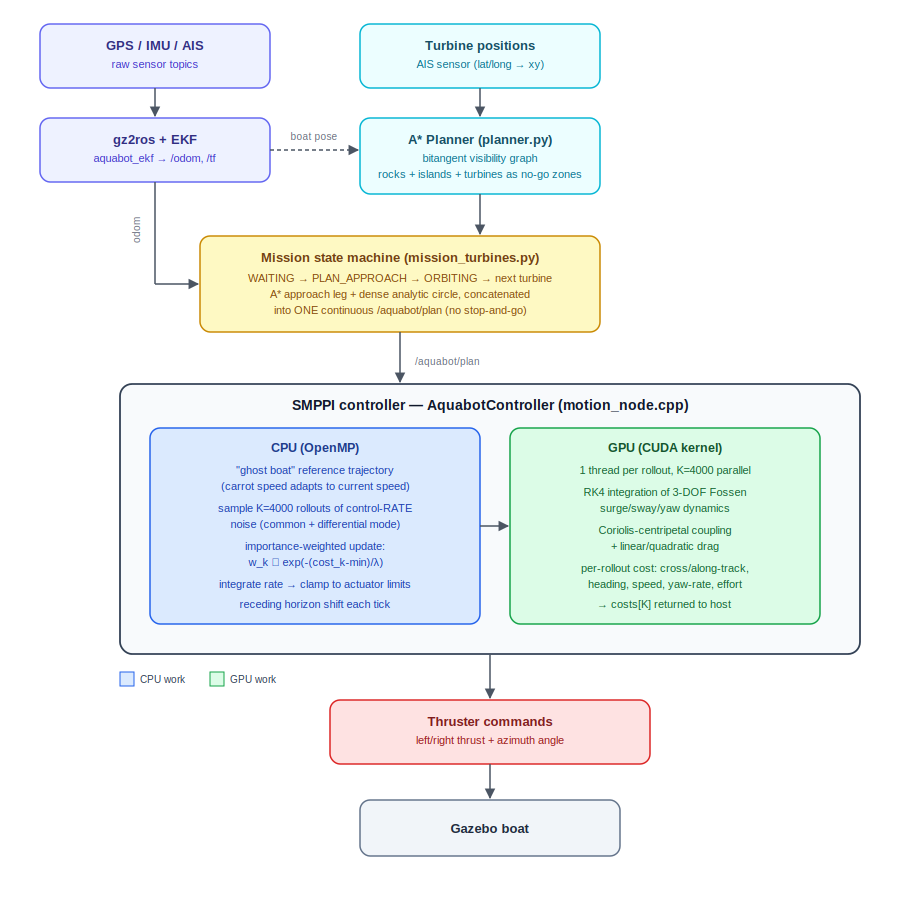

# Aquabot MPPI

**GPU-accelerated Smooth Model Predictive Path Integral (SMPPI) control for the [Aquabot Challenge](https://github.com/oKermorgant/aquabot)** — an autonomous boat that has to plan a rock-aware route through a wind-turbine farm, orbit each turbine, and read its QR code.

This project is a fork of the [Centrale Nantes ROS 2 Aquabot lab](https://github.com/oKermorgant/aquabot) by O. Kermorgant, itself adapted from the [Sirehna Aquabot Challenge](https://github.com/sirehna/aquabot). The lab scaffolding (simulator, EKF localization, base planner/control interfaces) comes from that repo — what's added here is a full GPU SMPPI controller, a rock-aware global planner, and a continuous-orbit inspection mission.

<!-- TODO: hero GIF/video here, e.g.

or link a video: [Watch the full inspection run](docs/demo.mp4)
-->

## Table of contents

- [Overview](#overview)
- [What this fork adds](#what-this-fork-adds)
- [Architecture](#architecture)
- [Controller: Smooth MPPI](#controller-smooth-mppi)
- [Global planner](#global-planner-rock-aware-a)
- [Mission: continuous turbine inspection](#mission-continuous-turbine-inspection)
- [QR inspection](#qr-inspection-in-progress)
- [Results](#results)
- [Roadmap](#roadmap--known-limitations)
- [Acknowledgments](#acknowledgments)
- [License](#license)

## Overview

The simulation is about an autonomous boat with 4 inputs — 2 thruster inputs and 2 steerable azimuth thruster angles — set in a Gazebo world with islands, rocks, and wind turbines. Each turbine carries a QR code on one side.

The goal is to build a controller that can follow a planned trajectory closely enough to inspect every turbine — reading its QR code while orbiting, then holding station in front of a pinger-designated turbine for a final close-up pass.

We chose Model Predictive Path Integral (MPPI) control for this because the boat's dynamics are full of nonlinearities — drag, actuator saturation, coupled surge/sway/yaw motion — that a sampling-based controller like MPPI handles naturally, without needing to linearize anything.

Everything runs over ROS 2 topics in the `/aquabot` namespace — see the [base repo](https://github.com/oKermorgant/aquabot) for the full topic/message reference.

## What this fork adds

| Component | File(s) | Description |
|---|---|---|
| GPU MPPI controller | `motion_node.cpp`, `mppi_kernels.cu` | Smooth MPPI trajectory tracking — rollout simulation and cost evaluation run on the GPU |
| Global planner | `planner.py` | A\* over a bitangent visibility graph around obstacles and turbines |
| Continuous orbit mission | `mission_turbines.py` | one continuous approach-and-orbit path per turbine, instead of discrete stop-and-go waypoints |
| QR decoding | `qr_reader.py` | OpenCV-based decode of turbine QR codes, publishes to the checkup topic (WIP) |

## Architecture

Sensors flow through the course's EKF into `/odom`. The turbine AIS positions feed an A\* planner, which the mission state machine calls once per turbine to get an approach leg, then appends a dense analytic circle to it — publishing one continuous path rather than a string of waypoints. The SMPPI controller tracks that path: reference-trajectory construction, noise sampling and the control update run on the CPU (OpenMP), while the actual rollout simulation and cost evaluation for all K trajectories run in parallel on the GPU (CUDA). A separate QR-reading node watches the camera independently.

## Controller: Smooth MPPI

### What is MPPI

Model Predictive Path Integral (MPPI) control is a sampling-based flavor of model predictive control. Instead of solving for an optimal control sequence analytically, it simulates many randomly perturbed versions of a nominal control sequence forward through the actual nonlinear dynamics model, scores each resulting trajectory with a cost function, and blends the samples into an updated nominal sequence — weighted toward whichever rollouts scored best. Repeating this every control cycle, on a receding horizon, gives closed-loop feedback without ever needing to linearize the dynamics or the cost.

### Why "smooth"

Vanilla MPPI samples and applies raw actuator *values*, which tends to produce jittery commands. Here the sampled controls are **rates** — `d(thrust)/dt` and `d(angle)/dt` for each thruster — which get integrated and clamped to `max_thrust_delta` / `max_angle_delta` before being applied. The result is a control sequence that respects real actuator slew limits by construction, instead of relying on the cost function to discourage jerkiness after the fact.

### Dynamics model

A 3-DOF Fossen surge/sway/yaw model, identical on CPU (used to publish the predicted optimal path) and GPU (used inside the rollout kernel):

- Linear + quadratic drag on each of surge (`u`), sway (`v`), yaw rate (`r`)
- Coriolis-centripetal coupling between surge/sway/yaw
- Integrated with RK4 at `dt = 0.1 s`

<!-- TODO: confirm which of these are tuned-to-sim vs. estimated, if worth noting -->

| Param | Meaning | Value |
|---|---|---|
| `L`, `W` | hull length / width | 6.0 m, 1.2 m |
| `m_u`, `m_v`, `m_r` | effective mass/inertia (surge, sway, yaw) | 1000, 1000, 446 |
| `d_u`, `d_v`, `d_r` | linear drag | 182, 183, 1199 |
| `d_u_quad`, `d_v_quad`, `d_r_quad` | quadratic drag | 224, 149, 979 |

### Sampling

| Param | Value |
|---|---|
| Rollouts `K` | 4000 |
| Horizon | 60 steps (6 s lookahead @ 0.1 s) |
| Noise model | Gaussian, common-mode + differential-mode per thruster pair (so trim/vectoring is sampled separately from paired thrust/steer) |
| `λ` (temperature) | 40.0 |
| Update gain | 0.6 |

All `K × horizon` noise draws are generated CPU-side with OpenMP across cores, then shipped to the GPU alongside the current state and nominal control sequence. `mppi_rollout_kernel` assigns one CUDA thread per rollout, forward-simulates the full horizon, and returns a single cost per rollout.

### Reference trajectory — the "ghost boat"

Rather than tracking a fixed-speed carrot, the reference point walks along `/aquabot/plan` at a speed that adapts to the boat's *current* speed (floored at a minimum, led by a small acceleration margin, capped at cruise target). This keeps the reference from running away from a boat that's still accelerating, while still pulling it up to cruise speed.

### Cost function

Evaluated once per rollout per horizon step, summed over the horizon:

| Term | Shape | Purpose |
|---|---|---|
| Cross-track error | Huber (quadratic < 1 m, linear beyond) | keep the boat on the path; doesn't blow up if a sampled rollout is briefly far off |
| Along-track error | quadratic, low weight | loose — doesn't fight the speed term |
| Heading error | quadratic, with deadband | align with the path tangent |
| Speed tracking | quadratic vs. fixed target speed | maintain cruise speed through turns, no brake-slamming |
| Yaw-rate | quadratic | discourage spin-out |
| Thrust effort | quadratic | frugal throttle use |
| Steering effort | quadratic, low weight | prefer vectoring (turning both nozzles) over aggressive differential thrust |

### Control update & receding horizon

Rollout costs are converted to importance weights via `w_k ∝ exp(-(cost_k − min_cost)/λ)`, normalized, and used to nudge the nominal control-rate sequence toward the lower-cost rollouts. The rate sequence is clamped to prevent windup, the first step is integrated and published, and the whole sequence is shifted left by one step (receding horizon) with the tail zero-padded for the next cycle.

### CPU/GPU split

| Stage | Where |
|---|---|
| Reference trajectory construction | CPU |
| Noise sampling (K × horizon × 4) | CPU, OpenMP-parallel across rollouts |
| Rollout simulation (RK4 dynamics × K) | **GPU**, one CUDA thread per rollout |
| Cost evaluation | **GPU**, fused into the same kernel |
| Importance-weighted update | CPU |
| RViz visualization (rollout "tentacles", optimal path) | CPU |

The control loop logs a `setup / noise / gpu / viz / rest` timing breakdown each cycle so you can see where the budget goes relative to the `dt = 0.1 s` (100 ms) control period.

<!-- TODO: drop in actual measured timings / GPU model once you have numbers, e.g.
On an RTX ????, a full 4000-rollout × 60-step cycle takes ~?? ms, leaving headroom for the 100 ms loop.
-->

## Global planner: rock-aware A*

`planner.py` builds a bitangent-based visibility graph around every obstacle — islands, rocks, and (once known) turbines — and runs A\* over it, exposed as:

- A `nav_msgs/GetPlan` service on `/aquabot/get_plan`
- A `goal_pose` subscription for RViz's **2D Goal Pose** button (uses the boat's current pose as start)
- Obstacle markers published for RViz visualization

## Mission: continuous turbine inspection

`mission_turbines.py` runs a small state machine (`WAITING_FOR_DATA → PLAN_APPROACH → WAITING_FOR_PLAN → ORBITING → …`) that, for each turbine in turn:

1. Calls the A\* planner for an approach leg to the edge of the inspection ring
2. Appends a dense analytic circle (36 points, configurable arc/direction/radius) starting exactly where the approach leg ends
3. Publishes the concatenation as **one continuous path** on `/aquabot/plan`

The single-path design is deliberate: driving discrete stop-and-go waypoints around a turbine saturates the tracker's steering and causes oscillation. One smooth path lets the SMPPI controller stay in its comfortable tracking regime the whole way round. Once a turbine's orbit sweeps its configured completion arc, the mission advances to the next turbine's approach — the boat never fully stops between turbines.

## QR inspection (in progress)

`qr_reader.py` currently covers step 1 of the optional challenge: prove decoding works. It runs OpenCV's QR detector through four strategies in order (plain → curved → 2× upscaled → Otsu-binarized), logs how much of the frame the code covers and its aspect ratio (to find the usable read range), and republishes each newly-seen code to `/vrx/windturbinesinspection/windturbine_checkup`.

Not yet wired: camera aiming, facing-direction computation, and handing off to the mission's 30-second station-keep + round-turn once all codes are read.

## Results

Measured over a full 4-turbine inspection run (451 s, logged at 10 Hz):

| Metric | Overall | Steady-state* |
|---|---|---|
| Mean speed | 1.268 m/s | 1.274 m/s (σ = 0.114) |
| Mean cross-track error | 0.745 m | 0.502 m |
| Median cross-track error | 0.464 m | 0.399 m |
| 95th percentile cross-track error | 1.78 m | 1.26 m |
| Max cross-track error | 6.97 m | 1.43 m |

\*excludes a ±3 s window around each of the 4 turbine-to-turbine transitions — the numbers that actually reflect the controller's tracking quality, isolated from planner latency (see below).

The boat holds the planned path tightly through both full orbits and both approach legs — cross-track error stays under ~0.5 m for the large majority of the run. There's one clear outlier.

Four turbine-to-turbine transitions show up as brief deviation spikes (shaded above), three of them small (1.5–2.5 m peak, under ~14 s). The second one is a genuine outlier — 6.97 m peak, sustained for 16 s. It's not a control failure: `mission_turbines.py` calls the A\* planner **asynchronously** when an orbit completes and waits for the new approach path before advancing state; the MPPI controller keeps tracking the *old* plan (whose last waypoint the boat has already passed) until the new one arrives. That specific hop happened to be the longest inter-turbine leg in the run, so the planner call took longer and the boat drifted further before snapping onto the fresh path. See [Roadmap](#roadmap--known-limitations).

<!-- TODO: hero/full-mission video links here once uploaded -->

## Roadmap / known limitations

**QR Code Reading:**
- [ ] Wire QR facing/aiming into the mission's station-keep phase
- [ ] 30 s stabilization + round turn in front of the pinger-designated turbine

**Tracking:**
- [ ] Overlap next-turbine planning with the tail of the current orbit (pre-fetch the approach path before the orbit finishes) instead of waiting for `PLAN_APPROACH` after completion — eliminates the stale-plan deviation seen during turbine-to-turbine handoffs (see [Results](#results))

## Acknowledgments

- [O. Kermorgant / Centrale Nantes](https://github.com/oKermorgant/aquabot) — course lab scaffolding, simulator packages, EKF/localization helpers
- [Sirehna](https://github.com/sirehna) — original Aquabot Challenge

## License

This project inherits the Apache-2.0 license of the upstream repository — see [`LICENSE`](LICENSE).
